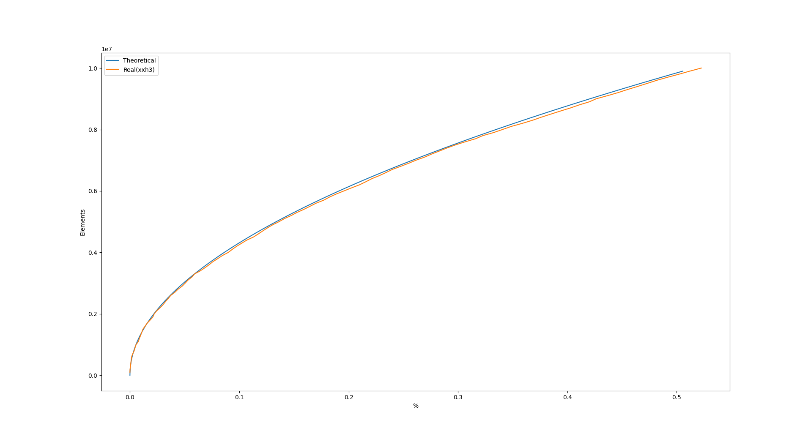

# Libbloomfilter - A lock-less bloom filter implemented in c
This library is optimized to achive ~0.05 error rate at 10 000 000 elements.

*Theoretical vs real performance for ``k=2`` and ``n=2^28``*

Theoretical error rate is calulated by [1]``(1-e^(-k*n/b))^k``

A bloom filter can vary on k keys used and n elemnts in hash table.
``k=2`` was used mainly becuse it can be ceaply be achived by splitting a 64bit hash in two.

xxh3 hash was used witch at the point of writinig is state of the art.

In order the achive a error rate ~0.05 a ``n=2^28`` is required.

## Content
``docs/`` contains misc docs

``examples/`` contains example use in c

``lua/`` contains lua ffi bindings

``src/`` source code

``tests/`` various testing tools including benchmarking(ops/s) and unit tests

``tools/`` visualization tools

## Installation
xxhash[2] is needed to build, you install it or just.
```bash
cd src/
wget https://raw.githubusercontent.com/Cyan4973/xxHash/dev/xxhash.h
```
To install run
```bash
make install
```
To run benshmarks and tests
```bash
make run_tests      # run unit tests
make benchmark      # run benchmark
make benchmark_swap # run swap benchmark
```
## Usage
### Allocators
```c
// ------ Allocators --------
// Normal
void *bloomfilter_alloc(size_t);
void bloomfilter_free(void *filter, size_t);
// SHM
void *bloomfilter_shm_alloc(size_t);
void bloomfilter_shm_free(void *filter, size_t);
```
``_alloc`` and ``_free`` is passed into ``_new`` and ``_destroy``.


SHM makes the filter shared over all processes forking from the process that
creates the filter or swapfilter.
### Filter

#### Contruction
```c
bloomfilter_t *bloomfilter_new(bloomfilter_allocator allocators);
void bloomfilter_destroy(bloomfilter_t **filter,
			 bloomfilter_deallocator deallocators);
```
#### Operators
```c
void bloomfilter_clear(bloomfilter_t *filter);
void bloomfilter_add(bloomfilter_t *filter, const void *key, size_t keylen);
int bloomfilter_test(bloomfilter_t *filter, const void *key, size_t keylen);
```
### Swapfilter
#### Construction
```c
bloomfilter_swap_t *bloomfilterswap_new(bloomfilter_allocator allocator);
```
Creates a set of filters, the active returing ``true`` to any test
```c
void bloomfilterswap_destroy(bloomfilter_swap_t **swap,
			     bloomfilter_deallocator deallocator);
```
#### Operations
```c
void bloomfilterswap_swap(bloomfilter_swap_t *filter);
```
Swaps betwene active and passive filter and clear passive filter.
```c
void bloomfilterswap_add(bloomfilter_swap_t *filter, const void *key,
			 size_t keylen);
```
Adds to passive and active filter
```c
int bloomfilterswap_test(bloomfilter_swap_t *filter, const void *key,
			 size_t keylen);
```
Checks for key in the active filter
#### LUA
```nginx
worker_processes  12;

events{}

http {
    init_by_lua_block {
        local err
        bloom, err = require("bloomfilter")()
        if not bloom then
            return ngx.log(ngx.ERR, "INIT_ERR: ", err)
        end
        _G.bloom = bloom
    }

    server {
        listen 8080;
        location / {
            content_by_lua_block {
                if ngx.var.uri == "/swap" then
                    bloom.swap()
                    return ngx.say("SWAP");
                end
                if ngx.var.request_method == "POST" then
                    bloom.add(ngx.var.uri);
                    return ngx.say("OK")
                end
                ngx.log(ngx.ERR, bloom.test(ngx.var.uri));
                return bloom.test(ngx.var.uri) and ngx.say("HIT") or ngx.exit(404)
            }
        }
    }
}
```
## Sources
- [1] [Wikipeida - Bloom_filter](https://en.wikipedia.org/wiki/Bloom_filter)
- [2] [GitHub - Cyan4973/xxHash](https://github.com/Cyan4973/xxHash)
